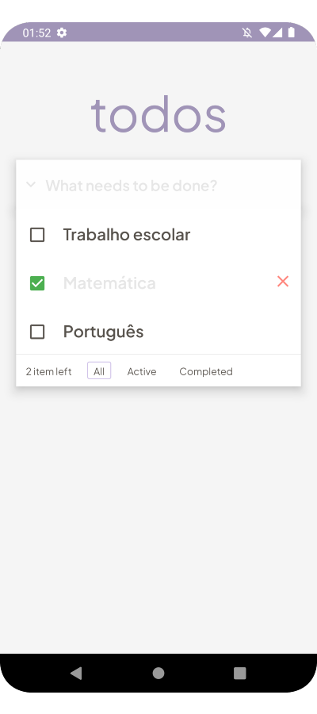

# todos
The classic To-Do application where a user can write down all the things he wants to accomplish.

## **User Stories**

- [x]  User can see an `input` field where he can type in a to-do item
- [x]  By pressing enter (or a button), the User can submit the to-do item and can see that being added to a list of to-do's
- [x]  User can mark a to-do as `completed`
- [x]  User can remove a to-do item by pressing on a button (or on the to-do item itself)

## **Bonus features**

- [x]  User can edit a to-do
- [x]  User can see a list with all the completed to-do's
- [x]  User can see a list with all the active to-do's
- [x]  User can see the date when he created the to-do
- [x]  When closing the browser window the to-do's will be stored and when the User returns, the data will be retrieved

